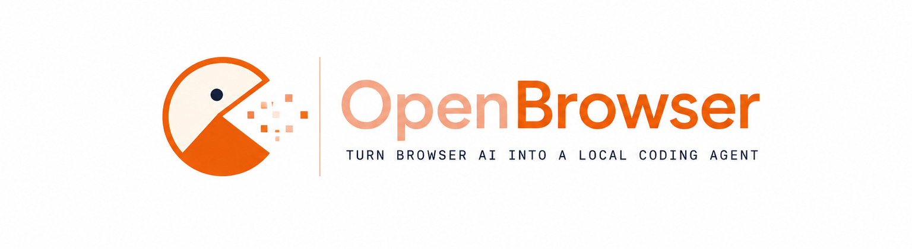

#  <span style="color: #FFDAB9;">Open</span><span style="color: #FF8C00;">Browser</span>

<p align="center">
  
</p>

**Turn free browser AI chat into a local coding agent.**

OpenBrowser is a local-first CLI that connects ChatGPT, Gemini, DeepSeek, Claude, Perplexity, GLM, Grok, and other browser-based AI assistants to your project workspace. Run commands in the terminal — prompts are **auto-sent to your AI tab** via the browser extension, responses flow back to the terminal automatically. No manual copy-paste.

---

## Features

| Mode       | What it does                                                                                |
| ---------- | ------------------------------------------------------------------------------------------- |
| **Ask**    | Auto-send prompt with system instructions; Markdown response appears in the terminal        |
| **Agent**  | Auto-send task + project context + JSON schema instructions; preview diffs, apply or reject |
| **Server** | Run the bridge API on `http://127.0.0.1:5000` for the browser extension                     |

- Local bridge server (Fastify) on port **5000**
- Interactive wake mode — run `openbrowser` with no args for an ask/agent menu
- `@file` / `@folder` context attachments with Tab completion
- Large prompts auto-delivered as `openbrowser-prompt.txt` when they exceed the UI paste limit
- Zod-validated AI operation schema (`CREATE_FILE`, `EDIT_FILE`, etc.)
- Unified diff preview before any file is touched
- Edit history stored in `.openbrowser/history.json`
- Chrome extension for supported AI sites

---

## Requirements

- **Node.js** 20 or later
- **pnpm** 11.x ([install guide](#install-pnpm))
- **Google Chrome** (or any Chromium browser) for the extension

---

## Quick Start

```bash
# 1. Clone and install
git clone <your-repo-url> openbrowser
cd openbrowser
pnpm install

# 2. Build the CLI
pnpm build

# 3. Enable the openbrowser command in your terminal
pnpm setup
pnpm link --global

# 4. Copy environment config
copy .env.example .env

# 5. Load the Chrome extension (see Browser Extension section)

# 6. Open https://chatgpt.com in Chrome and reload the tab

# 7. Open a new PowerShell window, then run
openbrowser ask "How do I add JWT auth in Express?"
```

> **Before running:** An AI chat tab must be open in Chrome with the extension loaded. The extension listens over SSE and auto-injects prompts.

> **Getting `openbrowser is not recognized`?**  
> Run `pnpm setup`, then `pnpm build` and `pnpm link --global`, and open a **new** terminal. Or use `pnpm start ask "..."` without global install — see [CLI Usage](#cli-usage).

---

## Install pnpm

```bash
corepack enable
corepack prepare pnpm@11.0.0 --activate
```

Verify:

```bash
node -v    # v20+
pnpm -v    # 11.x
```

---

## Installation

### 1. Install dependencies

```bash
pnpm install
```

### 2. Configure environment

```bash
copy .env.example .env
```

| Variable                      | Default      | Description                                                    |
| ----------------------------- | ------------ | -------------------------------------------------------------- |
| `PORT`                        | `5000`       | Bridge server port                                             |
| `BRIDGE_TOKEN`                | _(optional)_ | Bearer token for `/operations` and `/session/prompt` requests  |
| `PROMPT_INJECTION_CHAR_LIMIT` | `12000`      | Above this length, prompts are sent as a `.txt` file attachment |

### 3. Build

```bash
pnpm build
```

Compiled output is written to `dist/`.

---

## CLI Usage

### Make `openbrowser` available in your terminal

The `openbrowser` command is **not** installed automatically. PowerShell shows:

```text
openbrowser: The term 'openbrowser' is not recognized ...
```

That is expected until you complete the setup below.

#### Option A — Global command (recommended)

**One-time pnpm PATH setup** (required on Windows):

```powershell
pnpm setup
```

Close and reopen PowerShell after this command. It adds `%LOCALAPPDATA%\pnpm` to your PATH.

**Register the CLI** (run from the project root after every fresh clone):

```powershell
pnpm build
pnpm link --global
```

Verify in a **new** terminal:

```powershell
openbrowser --help
```

#### Option B — Run without global install

From the project root:

```powershell
# Compiled CLI (requires pnpm build first)
pnpm start ask "Explain this repo structure"
pnpm start agent "Add input validation"
pnpm start server

# Dev mode with auto-reload (no build needed)
pnpm dev
pnpm exec tsx src/index.ts ask "Explain this repo structure"
```

#### Option C — Interactive dev mode

```powershell
pnpm dev
```

Starts the CLI in watch mode. With no arguments, you get an interactive menu:

```
Select mode:
  1. ask
  2. agent
  q. exit
mode>
```

Use `@path/to/file` in the prompt area for context attachments. Tab completes paths after `@`.

---

### Commands

```powershell
openbrowser                          # Interactive mode (ask / agent menu)
openbrowser ask "<prompt>"           # Ask mode — Q&A in terminal
openbrowser agent "<task>"           # Agent mode — file ops with diff preview
openbrowser server                   # Run bridge server only (no CLI workflow)
openbrowser --help                   # Show all commands
openbrowser --version                # Show version
```

### Ask mode

```powershell
openbrowser ask "How do I implement rate limiting in Fastify?"
```

1. Bridge server starts on port 5000.
2. CLI queues the prompt with a **system instruction** (Markdown answer expected).
3. Chrome extension receives the job instantly via SSE, injects the message into the AI composer, and clicks Send.
4. When the AI finishes replying, the extension captures the text and posts it to the bridge.
5. CLI receives the response over SSE and prints it in the terminal.

### Agent mode

```powershell
openbrowser agent "Add a health check endpoint to the server"
```

1. Project context is generated from the current directory.
2. CLI queues task + context + **JSON schema system instructions**.
3. Extension auto-sends to the AI tab and waits for a JSON response with `conversationId`.
4. CLI validates the JSON, shows unified diffs for each proposed change.
5. Confirm with `y` to apply, or `N` to reject.

All applied changes are logged under `.openbrowser/history.json`.

### Long prompts (file attachment)

When a prompt (including system instructions and `@` context) exceeds **12,000 characters** by default, OpenBrowser saves the full text to `.openbrowser/prompts/<session>.txt` and the extension uploads it as **`openbrowser-prompt.txt`** instead of pasting into the composer. A short note is sent in the text field telling the AI to read the attachment.

Override the limit with `PROMPT_INJECTION_CHAR_LIMIT` in `.env`.

---

## Bridge Server

The bridge server is the local API that connects the CLI, browser extension, and file operations.

### Start the server

**Dedicated server command** (keeps running until you stop it):

```powershell
openbrowser server
```

**Dev watch mode** (auto-restarts on file changes):

```powershell
pnpm dev:server
```

**Embedded server** — `openbrowser ask` and `openbrowser agent` start the server automatically and shut it down when the command finishes.

### Default URL

```
http://127.0.0.1:5000
```

### Endpoints

| Method | Path                           | Description                                     |
| ------ | ------------------------------ | ----------------------------------------------- |
| `GET`  | `/health`                      | Health check (used by the extension popup)      |
| `GET`  | `/summary`                     | Project context summary                         |
| `POST` | `/session/prompt`              | CLI submits prompt job with system instructions |
| `GET`  | `/session/:id/events`          | CLI SSE stream for completed response           |
| `GET`  | `/session/:id/status`          | Poll session status                             |
| `GET`  | `/browser/events`              | Extension SSE stream for new prompt jobs        |
| `POST` | `/browser/claim`               | Extension claims a job before processing        |
| `GET`  | `/browser/prompt-file/:id`     | Extension downloads prompt `.txt` for attachment |
| `POST` | `/browser/chunk`               | Extension streams partial ask-mode responses    |
| `POST` | `/browser/response`            | Extension posts AI reply back to bridge         |
| `POST` | `/operations/preview`          | Preview diffs for operations                    |
| `POST` | `/operations/apply`            | Apply validated operations                      |

### Verify the server is running

```powershell
curl http://127.0.0.1:5000/health
```

Expected response:

```json
{ "status": "ok" }
```

Or open `http://127.0.0.1:5000/health` in your browser.

---

## Browser Extension (Chrome)

The extension watches supported AI chat pages, injects prompts, captures responses, and forwards them to the local bridge server.

### Supported sites

| Provider    | URL                                              |
| ----------- | ------------------------------------------------ |
| ChatGPT     | [chatgpt.com](https://chatgpt.com)               |
| Gemini      | [gemini.google.com](https://gemini.google.com)   |
| DeepSeek    | [chat.deepseek.com](https://chat.deepseek.com)   |
| Claude      | [claude.ai](https://claude.ai)                   |
| Perplexity  | [perplexity.ai](https://www.perplexity.ai)       |
| GLM         | [chat.z.ai](https://chat.z.ai)                   |
| Grok        | [grok.com](https://grok.com)                     |

### Load the extension in Chrome

1. **Start the bridge server** (extension needs port 5000):

   ```powershell
   openbrowser server
   ```

2. **Open Chrome extensions page**:

   ```
   chrome://extensions
   ```

3. **Enable Developer mode** (toggle in the top-right corner).

4. **Click "Load unpacked".**

5. **Select the `browser-extension` folder** inside this repo (the folder that contains `manifest.json`).

6. **Pin the extension** — click the puzzle icon in the Chrome toolbar → pin **OpenBrowser Bridge**.

7. **Verify connection** — click the extension icon. The popup should show:

   ```
   Bridge server is running on port 5000.
   ```

   If it says _"Bridge server is not reachable"_, make sure `openbrowser server` is running.

### How the extension works

1. You run `openbrowser ask` or `openbrowser agent` in your project directory.
2. The CLI submits a prompt job to `POST /session/prompt` on the bridge server.
3. The bridge pushes the job instantly over SSE to `GET /browser/events`.
4. The content script claims the job, injects the message (or attaches `openbrowser-prompt.txt` for long prompts), and clicks Send.
5. When the AI reply is complete, the extension posts it to `POST /browser/response`.
6. The CLI receives the result over `GET /session/:id/events` and prints it in the terminal.

> **Important:** Keep an AI chat tab open and reload it after updating the extension.

---

## AI Response Format

Agent mode expects JSON like this:

```json
{
  "operations": [
    {
      "action": "CREATE_FILE",
      "path": "src/example.ts",
      "content": "export const hello = 'world';\n"
    }
  ],
  "conversationId": "550e8400-e29b-41d4-a716-446655440000"
}
```

Supported actions: `CREATE_FILE`, `EDIT_FILE`, `DELETE_FILE`, `RENAME_FILE`, `CREATE_FOLDER`.

Paths must be relative to the project root. Directory traversal (`../`) is rejected.

---

## Development

```powershell
pnpm dev           # CLI in watch mode (tsx)
pnpm dev:server    # Bridge server in watch mode
pnpm build         # Compile TypeScript → dist/
pnpm typecheck     # Type-check without emitting
pnpm test          # Run Vitest unit tests
pnpm test:watch    # Vitest in watch mode
```

### Project layout

```
openbrowser/
├── assest/               # Logo, banner, favicon (marketing assets)
├── src/
│   ├── index.ts          # CLI entry point
│   ├── server/           # Bridge server (Fastify + SSE)
│   ├── context/          # Project context & @ attachments
│   ├── protocol/         # Zod schemas & validation
│   ├── parser/           # AI response parsing
│   ├── operations/       # Diff preview & file executor
│   ├── memory/           # .openbrowser storage
│   └── shared/           # Terminal UI, prompt delivery
├── browser-extension/    # Chrome MV3 extension
├── dist/                 # Compiled output (after pnpm build)
├── .env.example
├── package.json
└── pid.md                # Full product specification
```

---

## Troubleshooting

### `openbrowser` is not recognized (PowerShell)

| Cause                       | Fix                                                |
| --------------------------- | -------------------------------------------------- |
| pnpm global bin not in PATH | Run `pnpm setup`, restart PowerShell               |
| Project not built           | Run `pnpm build`                                   |
| CLI not linked globally     | Run `pnpm link --global`, then open a new terminal |
| Want to skip global install | Use `pnpm start ask "..."` or `pnpm dev`           |

### Timed out waiting for browser AI response

1. Open a supported AI site in Chrome (not Edge/Firefox alone).
2. Reload the AI tab after installing the extension.
3. Reload the extension on `chrome://extensions`.
4. Confirm the popup shows _"Bridge running"_ and at least one AI tab ready.
5. Run `openbrowser` from the project root — ask/agent start their own bridge server automatically.

### Extension shows "Bridge server is not reachable"

1. Confirm the server is running (started automatically by `openbrowser ask` / `openbrowser agent`).
2. Check port 5000 is free: `curl http://127.0.0.1:5000/health`
3. Reload the extension on `chrome://extensions`
4. Leave `BRIDGE_TOKEN` unset for local dev (extension does not send auth headers)

### Long prompt not attaching

1. Confirm the provider supports file upload (ChatGPT, Claude, Gemini, DeepSeek).
2. Check `.openbrowser/prompts/` for the saved session file.
3. Lower `PROMPT_INJECTION_CHAR_LIMIT` to test, or shorten `@` context attachments.

### Agent mode rejects the AI response

- Response must be valid JSON with `operations` and `conversationId` (UUID v4).
- No markdown code fences unless the JSON is inside them.
- Every `path` must stay inside the project root.

### Changes not applied

- You must confirm with `y` after reviewing diffs.
- Check `.openbrowser/history.json` for the operation log.
- Run agent mode from the **project root** you want to modify.

---

## Architecture

```
Terminal (CLI)  ──POST /session/prompt──►  Bridge :5000
       ▲                                        │
       │ SSE /session/:id/events                │ SSE /browser/events
       │                                        ▼
       └────── POST /browser/response ◄──  Chrome Extension
                                                  │
                                                  ▼
                              AI chat tab (ChatGPT, Gemini, Claude, …)
```

1. **CLI** — submits prompts with system instructions, waits for responses
2. **Bridge Server** — session queue, job dispatch, prompt file storage, response delivery
3. **Browser Extension** — SSE job delivery, composer injection / file attach, response capture
4. **Context Engine** — reads workspace and builds agent prompts
5. **Operation Executor** — applies approved file changes

For the full product specification, see [pid.md](./pid.md).

---

## License

MIT — open source. See [LICENSE](./LICENSE) when published.
