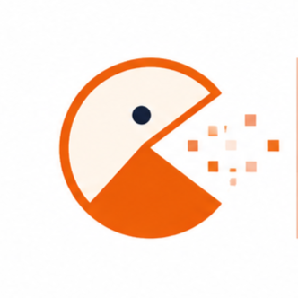
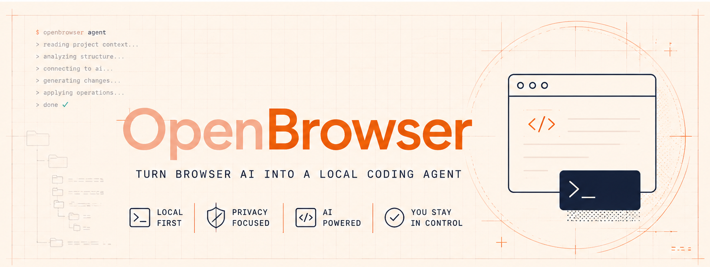
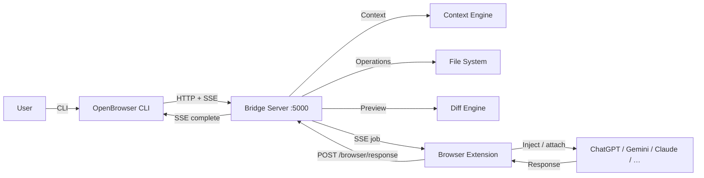

<h1 style="display: flex; align-items: center;">
  
  <span style="color: #FFDAB9;">Open</span>
  <span style="color: #FF8C00;">Browser</span>
</h1>


<p align="center">
  
</p>

# Project Information Document (PID)

## Project Name
**OpenBrowser**

## Alternative Names
- AI Bridge
- BrowserCoder
- WebAI Bridge
- OpenBridge
- Agent Bridge
- Universal AI Bridge

---

## Vision
OpenBrowser is a **local-first CLI agent** that transforms free browser-based AI chat platforms into powerful coding assistants. Users run a lightweight Node.js bridge on port **5000** and interact via three entry points:

- **Ask Mode** — Chat with AI and receive formatted Markdown responses in the terminal.
- **Agent Mode** — AI proposes file changes; the CLI shows diffs and the user accepts or rejects.
- **Interactive Wake Mode** — Running `openbrowser` with no subcommand starts the bridge, shows an ask/agent menu, and loops after each completed prompt.

The goal is an experience similar to Claude Code while letting developers keep using free browser AI subscriptions.

---

## Problem Statement
Browser AI can generate code, explain bugs, and answer questions — but it cannot natively:

- Read an entire project
- Edit multiple files with diff preview
- Apply changes locally with user approval
- Maintain project memory under `.openbrowser/`

Developers currently copy-paste code file by file. OpenBrowser removes that loop.

---

## Proposed Solution
OpenBrowser has **two shipped components** (plus an optional future IDE plugin):

### 1. Browser Extension (Chrome MV3)
Runs on supported AI sites. **Responsibilities:**

- Subscribe to bridge SSE for prompt jobs
- Inject prompts into the AI composer (ProseMirror, Lexical, textarea)
- Attach `openbrowser-prompt.txt` when prompts exceed the paste limit
- Capture AI responses (JSON for agent, Markdown for ask)
- Post results back to the bridge

The extension **never** edits files directly.

### 2. Bridge Server + CLI
A Node.js service on port **5000** embedded in the `openbrowser` CLI. **Responsibilities:**

- `openbrowser ask`, `openbrowser agent`, `openbrowser server`, interactive wake mode
- Session queue and SSE delivery to CLI and extension
- Project context generation (`@` file/folder attachments)
- Zod validation, diff preview, file operations
- Terminal progress steps (`reading browser`, `loading`, `creating file`, `complete`)
- Large-prompt file storage under `.openbrowser/prompts/`

### 3. VS Code Extension (Future)
Optional IDE integration for workspace context, preview, and rollback.

---

## Architecture



### Why This Architecture
- **Local-first** — no cloud backend, no API keys, no project upload
- **SSE (not WebSocket)** — simpler extension integration, works through MV3 service worker
- **Two modes** — ask for chat, agent for file operations
- **Diff preview** — every change shown before application
- **File fallback** — long prompts survive composer character limits

---

## Supported AI Providers

| Provider   | Hosts                                              | Inject style   | File attach |
| ---------- | -------------------------------------------------- | -------------- | ----------- |
| ChatGPT    | chatgpt.com, chat.openai.com                       | ProseMirror    | Yes         |
| Claude     | claude.ai                                          | ProseMirror    | Yes         |
| Gemini     | gemini.google.com                                  | contenteditable| Yes         |
| DeepSeek   | chat.deepseek.com                                  | textarea       | Yes         |
| Perplexity | perplexity.ai                                      | Lexical        | Planned     |
| GLM        | chat.z.ai, glm.ai                                  | textarea       | Partial     |
| Grok       | grok.com, x.com                                    | mixed          | Planned     |

---

## User Workflow

### Ask Mode
```bash
$ openbrowser ask "How do I implement JWT authentication in Node.js?"
```
1. CLI builds system instructions + optional `@` context.
2. Bridge queues job; extension injects into AI composer and sends.
3. Response streams back; CLI renders Markdown in the terminal.
4. No file operations.

### Agent Mode
```bash
$ openbrowser agent "Create JWT authentication with login and middleware"
```
1. Context engine scans the workspace; `@` refs attach files/folders.
2. CLI sends task + JSON schema instructions to the AI via extension.
3. AI returns structured JSON + optional `---OB_FILE_BEGIN---` blocks.
4. CLI validates, shows unified diffs, prompts `y/N`.
5. Approved operations execute; history logged to `.openbrowser/history.json`.

### Interactive Wake Mode
```bash
$ openbrowser
```
Shows ask/agent menu, `@` hint, prompt area, and returns to mode selection after each session.

### Long Prompt Delivery
When the outbound message exceeds `PROMPT_INJECTION_CHAR_LIMIT` (default **12,000** chars):

1. Bridge writes full text to `.openbrowser/prompts/<sessionId>.txt`
2. Extension downloads via `GET /browser/prompt-file/:sessionId`
3. Extension uploads `openbrowser-prompt.txt` to the AI composer
4. A short composer note tells the AI to read the attachment

---

## Core Features

### Project Context
- Workspace tree, `package.json`, `tsconfig.json`
- `@path` file and folder attachments (Tab completion)
- Folder trees include **all** files (including images); only **text/source** files are embedded in context
- **Not supported for now:** image/binary context (png, jpg, gif, webp, pdf, fonts, etc.) — listed in tree only, not sent as content or vision attachments
- `.openbrowser/context-summary.md` output

### Structured AI Responses (Agent)
Zod-validated JSON with `operations` and `conversationId` (UUID v4).

### Diff Preview Engine
Unified diffs before `CREATE_FILE`, `EDIT_FILE`, `DELETE_FILE`, `RENAME_FILE`, `CREATE_FOLDER`.

### Workspace Editing
Node.js filesystem executor with path traversal protection.

### Project Memory (`.openbrowser/`)
| File                 | Purpose                    |
| -------------------- | -------------------------- |
| `history.json`       | Applied operation log      |
| `context-summary.md` | Auto-generated summary     |
| `prompts/*.txt`      | Large prompt attachments   |
| `project.json`       | Metadata (scaffolded)      |
| `settings.json`      | User preferences           |

---

## AI Response Schema
```json
{
  "operations": [
    {
      "action": "CREATE_FILE",
      "path": "src/example.ts",
      "content": "export const x = 1;\n"
    }
  ],
  "conversationId": "550e8400-e29b-41d4-a716-446655440000"
}
```

Rules: relative paths only, no `../`, UUID v4 `conversationId`, optional `error` field on validation failure.

---

## Security Model
- Local-only bridge on `127.0.0.1`
- Optional `BRIDGE_TOKEN` for protected routes
- Path sanitization on all file operations
- User must confirm before any write

---

## Technology Stack

### Core Runtime
| Component | Technology |
| --------- | ---------- |
| Runtime   | Node.js 20+ |
| Language  | TypeScript |
| CLI       | Commander.js |
| Package manager | pnpm 11 |

### Backend
| Library | Purpose |
| ------- | ------- |
| Fastify | HTTP server |
| SSE     | CLI ↔ bridge ↔ extension realtime |
| Zod     | Schema validation |
| pino    | Logging |
| dotenv-safe | Env validation |
| chokidar | File watching |
| fs-extra | Filesystem helpers |

### Context & Parsing
| Library | Purpose |
| ------- | ------- |
| fast-glob | File patterns |
| diff | Unified diffs |
| jsonc-parser | JSON with comments |

### Terminal UI
| Library | Purpose |
| ------- | ------- |
| cfonts | ASCII banner |
| chalk | Terminal colors |
| gradient-string | Peach → orange brand gradient |
| enquirer | Interactive selections |

### Browser Extension
Plain JavaScript MV3 — `content-script.js`, `background.js`, `providers.js`, `popup.html`.

---

## Repository Structure

```
openbrowser/
├── assest/                    # logo.png, banner.png, favicon.png
├── src/
│   ├── index.ts               # CLI entry
│   ├── core/                  # types, enums, errors
│   ├── protocol/              # Zod validation
│   ├── context/               # scanner, @ attachments, prompt input
│   ├── parser/                # AI response parsing (incl. OB_FILE blocks)
│   ├── operations/            # executor, diffs
│   ├── memory/                # .openbrowser storage
│   ├── server/                # Fastify + SSE hub + session store
│   ├── client/                # bridge-client
│   ├── prompts/               # system prompt templates
│   └── shared/                # terminal UI, prompt-delivery
├── browser-extension/
│   ├── manifest.json
│   ├── icons/                 # favicon + logo copies
│   └── src/
├── package.json
├── pid.md
└── README.md
```

Single-package layout — not a monorepo. Internal imports use relative paths.

---

## pnpm Setup

```bash
corepack enable
corepack prepare pnpm@11.0.0 --activate
pnpm install
pnpm build
```

| Script | Description |
| ------ | ----------- |
| `pnpm dev` | CLI watch mode |
| `pnpm dev:server` | Bridge watch mode |
| `pnpm build` | Compile to `dist/` |
| `pnpm test` | Vitest |

---

## Development Roadmap

### Phase 0 – Foundations ✅
- [x] Single-package pnpm project
- [x] `src/` module scaffold
- [x] CLI commands and interactive wake mode
- [ ] ESLint, Prettier, Husky
- [ ] CI (GitHub Actions)

### Phase 1 – Core Engine ✅
- [x] Zod protocol + path traversal protection
- [x] Context generation + `@` attachments
- [x] Operation executor + unified diffs + history
- [x] Fastify bridge + SSE endpoints

### Phase 2 – CLI & Terminal ✅
- [x] Ask / agent flows with auto bridge lifecycle
- [x] Diff preview + accept/reject
- [x] Branded terminal banner (cfonts + chalk + gradient-string)
- [x] Buffered prompt input with `@` Tab completion

### Phase 3 – Browser Extension ✅
- [x] MV3 extension for ChatGPT, Gemini, DeepSeek, Claude, Perplexity, GLM, Grok
- [x] SSE job dispatch, ProseMirror/Lexical/textarea injection
- [x] Agent JSON + OB_FILE block capture
- [x] Extension favicon + popup logo

### Phase 4 – Polish & Open Source 🚧
- [x] Long-prompt `.txt` file attachment delivery
- [x] README + PID marketing assets
- [ ] MIT LICENSE file
- [ ] npm publish + semantic versioning
- [ ] Security audit + integration tests
- [ ] Perplexity / Grok file-attach support
- [ ] Image / binary file context (vision uploads or separate attachments)

---

## Success Criteria
A developer should be able to:

1. `pnpm link --global` and run `openbrowser ask "question"`.
2. Receive a Markdown answer in the terminal without copy-paste.
3. Run `openbrowser agent "task"` and review diffs before applying.
4. Attach `@src/file.ts` context in interactive mode.
5. Send 20k+ character prompts via `openbrowser-prompt.txt` attachment.
6. Find all applied changes in `.openbrowser/history.json`.

---

## Long-Term Vision
OpenBrowser becomes the universal local bridge between browser AI and developer workspaces — any provider, any project, any language — without proprietary AI IDE lock-in.

---

## Chat-Limit Handling & Context Summarisation (Planned)
- Token budgeting before each request
- Auto summary to `.openbrowser/context-summary.md` when context exceeds budget
- Session migration after ~20 turns with history block injection

---

*End of Document*
