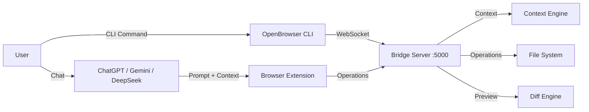

# Project Information Document (PID)

## Project Name
**OpenBrowser (Working Name)**  

## Alternative Names
- AI Bridge  
- BrowserCoder  
- WebAI Bridge  
- OpenBridge  
- Agent Bridge  
- Universal AI Bridge  

---  

## Vision
OpenBrowser is a **local CLI agent** that transforms free browser‑based AI chat platforms (ChatGPT, Gemini, DeepSeek, etc.) into powerful coding assistants. Users install a lightweight Node.js server that runs on port 5000 and interact via two distinct modes:

- **Ask Mode** – Chat with AI and receive beautifully formatted Markdown responses in the terminal.  
- **Agent Mode** – AI proposes file changes, displays diffs, and users can **accept all**, **accept one‑by‑one**, **reject**, or **reject all**.
- **Interactive Wake Mode** – Running `openbrowser` with no subcommand starts the local bridge server, shows `ask` and `agent` mode options, opens a prompt area, and returns to mode selection after each completed prompt.

The goal is to provide an experience similar to Claude Code while allowing developers to continue using free AI chat services.

---  

## Problem Statement
Current browser‑based AI platforms can:  

- Generate code  
- Explain bugs  
- Review code  
- Suggest improvements  
- Answer programming questions  

However, they cannot:  

- Read an entire project  
- Understand project structure  
- Edit multiple files  
- Create folders  
- Rename files  
- Delete files  
- Preview changes with diffs  
- Maintain project memory  
- Apply edits automatically  

Developers currently have to:  

1. Ask AI for code.  
2. Copy generated code.  
3. Switch to the IDE.  
4. Paste code.  
5. Fix formatting.  
6. Repeat for every file.  

This process is slow, repetitive, and error‑prone.

---  

## Proposed Solution
OpenBrowser is a **local‑first CLI agent** consisting of three components:

### 1. Browser Extension
Runs inside Chromium‑based browsers (Chrome, Edge, Brave, etc.).  
**Responsibilities**  
- Detect supported AI websites.  
- Capture user prompts.  
- Inject project context.  
- Read AI responses.  
- Validate structured output.  
- Forward operations to the local Bridge Server.  

The browser extension never edits files.

### 2. Bridge Server (CLI Agent)
A lightweight local Node.js service running on port 5000.  
**Responsibilities**  
- Accept CLI commands (`openbrowser ask`, `openbrowser agent`).  
- Start automatically from the shebang CLI when the user runs `openbrowser`.  
- Maintain active sessions.  
- Exchange messages with Browser Extension.  
- Route project context.  
- Validate requests.  
- Execute file operations.  
- Display diffs and handle user confirmations.  
- Display terminal progress steps such as `reading browser`, `loading`, `creating file`, and `complete`.

### 3. VS Code Extension (Optional Future)
Runs inside VS Code for enhanced integration.  
**Responsibilities**  
- Read workspace.  
- Build project context.  
- Maintain project memory.  
- Show preview.  
- Apply edits.  
- Rollback changes.  
- Track history.  

---  

## Architecture


### Why This Architecture
- **Local‑first**: No cloud backend, no API keys, no project upload.  
- **Two modes**: Ask mode for chat, Agent mode for file operations.  
- **Diff preview**: Every change is shown before application.  
- **User control**: Accept/reject options give full control over changes.  
- **Extensible**: Future IDE plugins can connect without changing the core.

---  

## User Workflow

### Ask Mode
```bash
$ openbrowser ask "How do I implement JWT authentication in Node.js?"
```
- CLI forwards prompt to AI via Browser Extension.  
- AI response is formatted with Markdown and displayed in terminal.  
- No file operations are performed.
- With no subcommand, users select `ask`, enter a prompt, paste the browser AI response, and then return to mode selection.

### Agent Mode
```bash
$ openbrowser agent "Create JWT authentication with login and middleware"
```
1. CLI requests project context from Context Engine.  
2. Context is injected into AI prompt.  
3. AI returns structured JSON with operations.  
4. Bridge Server validates and generates diffs.  
5. Terminal displays each change with diff preview.  
6. User selects: **accept all**, **accept one‑by‑one**, **reject**, **reject all**.  
7. Approved changes are applied to the workspace.

---  

## Core Features

### Feature 1 — Project Context
Read and generate an optimized project summary containing:  
- Workspace tree  
- `package.json` / `tsconfig.json`  
- Current file, open files  
- Dependencies, framework, symbols, imports, exports  

### Feature 2 — Prompt Enhancement  
Automatically enrich prompts using:  
- Project summary  
- Architecture overview  
- Dependencies & coding style  
- Recent changes & current task  

### Feature 3 — Structured AI Responses  
Every AI response **must** follow a strict JSON schema (see Section *AI Response Schema*). Raw code responses are rejected.

### Feature 4 — Diff Preview Engine  
Before applying edits, show:  
- File path  
- Added/removed lines (unified diff format)  
- Created/deleted files  

User actions: **Accept All**, **Accept One‑by‑One**, **Reject**, **Reject All**.

### Feature 5 — Workspace Editing  
Execute file operations via Node.js filesystem:  
- `CREATE_FILE`  
- `EDIT_FILE`  
- `DELETE_FILE`  
- `RENAME_FILE`  
- `CREATE_FOLDER`  

All changes are logged in `.openbrowser/history.json`.

### Feature 6 — Project Memory  
Persist state inside `.openbrowser/` with files:  
- `project.json` (summary, metadata)  
- `history.json` (edit history)  
- `settings.json` (user preferences)  
- `chat.json` (conversation log)  
- `tasks.json` (queued tasks)  
- `context-summary.md` (auto‑generated summary)  

---  

## AI Response Schema
All AI payloads are validated against the following **Zod** schema. The AI must output **only** this JSON—no extra text or markdown fences.

```json
{
  "type": "object",
  "properties": {
    "operations": {
      "type": "array",
      "items": {
        "type": "object",
        "properties": {
          "action": { "type": "string", "enum": ["CREATE_FILE","EDIT_FILE","DELETE_FILE","RENAME_FILE","CREATE_FOLDER"] },
          "path": { "type": "string", "description": "Relative path from project root." },
          "content": { "type": "string", "description": "Full file content (CREATE/EDIT only)" },
          "search": { "type": "string", "description": "Text to search for (EDIT only)" },
          "replace": { "type": "string", "description": "Replacement text (EDIT only)" }
        },
        "required": ["action","path"]
      }
    },
    "conversationId": { "type": "string", "format": "uuid" },
    "error": { "type": "string", "nullable": true }
  },
  "required": ["operations","conversationId"]
}
```

**Rules**  
1. Every operation must validate against the schema.  
2. `path` must be a relative path; it may start with `./` but must not escape the project root (`../` is prohibited).  
3. If validation fails, set `"error"` to a short human‑readable message and **omit** `operations`.  
4. `conversationId` must be a UUID v4 that identifies the current chat session; reuse it for follow‑up messages until the session ends.  
5. No additional fields or text are allowed.  

---  

## Security Model
- **Local‑first**: No cloud backend, no API keys, no project upload.  
- Only the project context included in prompts is shared with the selected AI provider.  
- Every workspace modification requires explicit user approval.  
- The Bridge Server validates all incoming operations before execution.  
- File paths are sanitized to prevent directory‑traversal attacks.  

---  

## Technology Stack

### Core Runtime
| Component | Technology | Purpose |
|-----------|------------|---------|
| **Runtime** | Node.js 20+ | JavaScript/TypeScript execution |
| **Language** | TypeScript | Type safety across all packages |
| **CLI Framework** | Commander.js | Command parsing and help generation |
| **Package Manager** | pnpm | Fast, disk-efficient dependency management (single package) |

### Backend / Server
| Library | Purpose |
|---------|---------|
| **Fastify** | Lightweight HTTP/WebSocket server (port 5000) |
| **WebSocket** | Real‑time communication with Browser Extension |
| **Zod** | Runtime schema validation |
| **pino** | Structured logging |
| **dotenv-safe** | Environment variable validation |
| **chokidar** | File‑system watching |
| **fs-extra** | Enhanced file‑system operations |

### Context & Parsing
| Library | Purpose |
|---------|---------|
| **fast-glob** | Fast file‑pattern matching |
| **diff** | Unified diff generation |
| **jsonc-parser** | JSON parsing with comments support |
| **tree-sitter** (future) | AST parsing for intelligent context |

### Terminal UI
| Library | Purpose |
|---------|---------|
| **Ink** | React for interactive CLI |
| **React** | Component‑based terminal UI |
| **marked** | Markdown rendering in terminal |
| **kleur** | Terminal colour formatting |
| **enquirer** | Interactive prompts and selections |
| **terminal-kit** | Advanced terminal controls |

### Development Tools
| Tool | Purpose |
|------|---------|
| **TypeScript** | Static typing |
| **ESLint** | Code linting |
| **Prettier** | Code formatting |
| **Husky** | Git hooks |
| **Vitest** | Unit testing |
| **tsx** | TypeScript execution |
| **typedoc** | API documentation generation |

---  

## Repository Structure

Single-package layout — all modules live under `src/` as internal folders (not separate npm packages).

```
openbrowser/
├─ .gitignore
├─ .npmrc                      # pnpm config (auto-install-peers)
├─ pnpm-lock.yaml
├─ package.json                # Single root package (no workspaces)
├─ tsconfig.json
├─ .env.example                # Example environment variables
├─ pid.md                      # Project Information Document
│
├─ src/
│   ├─ index.ts                # CLI entry point (openbrowser ask | agent)
│   │
│   ├─ core/                   # Shared types, enums, errors
│   │   ├─ types/
│   │   ├─ enums/
│   │   └─ errors/
│   │
│   ├─ protocol/               # JSON schema, Zod validation
│   │
│   ├─ context/                # Context generation & summarisation
│   │   ├─ scanner/            # (planned)
│   │   ├─ summarizer/         # (planned)
│   │   └─ formatter/          # (planned)
│   │
│   ├─ parser/                 # AI response parsing
│   │   ├─ extractors/         # (planned)
│   │   └─ transformers/     # (planned)
│   │
│   ├─ operations/             # File-system executor
│   │   ├─ executor/           # (planned)
│   │   ├─ diff/               # (planned)
│   │   └─ history/            # (planned)
│   │
│   ├─ memory/                 # .openbrowser storage, history, settings
│   │   ├─ storage/            # (planned)
│   │   └─ models/             # (planned)
│   │
│   ├─ shared/                 # Logger, utils, constants
│   │
│   ├─ server/                 # Fastify bridge server (port 5000)
│   │   ├─ routes/             # (planned)
│   │   └─ websocket/          # (planned)
│   │
│   └─ cli/                    # CLI commands & terminal UI (planned)
│       ├─ commands/
│       │   ├─ ask.ts
│       │   └─ agent.ts
│       └─ ui/
│           ├─ preview.tsx
│           └─ prompt.tsx
│
├─ browser-extension/          # Separate WXT/Plasmo project (future)
│   └─ src/
│       ├─ content-scripts/
│       ├─ background/
│       └─ popup/
│
└─ docs/                       # (planned)
    ├─ architecture.md
    ├─ roadmap.md
    └─ api-reference.md
```

### Why Single Package (Not Monorepo)
- **Simpler setup**: One `package.json`, one `pnpm install`, no workspace linking.
- **Faster iteration**: Internal imports use relative paths (`../protocol`) instead of `@openbrowser/*` packages.
- **Easier onboarding**: Contributors clone, install, and run — no multi-package build order.
- **Browser extension stays separate**: The Chromium extension will remain its own sub-project when added (different build toolchain).

---

## pnpm Setup

### Prerequisites
- **Node.js** 20 or later
- **pnpm** 9.x (enforced via `packageManager` field in `package.json`)

### Install pnpm
```bash
corepack enable
corepack prepare pnpm@9.15.0 --activate
```

### Install Dependencies
```bash
pnpm install
```

### Available Scripts
| Script | Command | Description |
|--------|---------|-------------|
| `dev` | `pnpm dev` | Run CLI in watch mode (tsx) |
| `dev:server` | `pnpm dev:server` | Run bridge server in watch mode |
| `build` | `pnpm build` | Compile TypeScript to `dist/` |
| `start` | `pnpm start` | Run compiled CLI |
| `typecheck` | `pnpm typecheck` | Type-check without emitting |
| `test` | `pnpm test` | Run Vitest unit tests |

### Installed Dependencies
| Category | Packages |
|----------|----------|
| **Runtime** | `commander`, `fastify`, `zod`, `pino`, `chokidar`, `fast-glob`, `diff`, `fs-extra`, `jsonc-parser`, `dotenv-safe` |
| **Dev** | `typescript`, `tsx`, `vitest`, `@types/node`, `@types/diff`, `@types/fs-extra` |

### Configuration Files
| File | Purpose |
|------|---------|
| `.npmrc` | Enables `auto-install-peers` for smoother dependency resolution |
| `tsconfig.json` | Strict TypeScript with `NodeNext` module resolution, output to `dist/` |
| `.env.example` | Template for `PORT` and `BRIDGE_TOKEN` environment variables |

---  

## Development Roadmap

### Phase 0 – Foundations (1 sprint) ✅ In Progress
- [x] Initialise single-package project with pnpm (`packageManager`, `.npmrc`, `tsconfig.json`).
- [x] Scaffold `src/` modules: core, protocol, context, parser, operations, memory, shared, server.
- [x] Install runtime and dev dependencies.
- [x] Implement CLI entry point with `openbrowser ask`, `openbrowser agent`, `openbrowser server`, and interactive wake mode.
- [ ] Add ESLint, Prettier, Husky.
- [ ] Scaffold CI pipeline (GitHub Actions).
- [ ] Add unit tests for protocol validation.

### Phase 1 – Core Engine (3 sprints) ✅ Implemented

| Sprint | Focus | Deliverables |
|--------|-------|--------------|
| **1** | Protocol & Validation | Implemented Zod schema in `src/protocol`, operation validation, and path traversal protection. |
| **2** | Context Generation | Implemented `src/context` scanner with `fast-glob`, package/tsconfig reading, and `.openbrowser/context-summary.md` output. |
| **3** | Operation Executor | Implemented `src/operations` executor, unified diff generation, history tracking, and dry-run planning. |
| **4** | Bridge Server | Implemented Fastify endpoints `/health`, `/summary`, `/session`, `/operations/preview`, `/operations/apply`, and `/browser/message` with optional bearer-token authentication. |

### Phase 2 – CLI & Terminal UI (3 sprints) ✅ Implemented

| Sprint | Focus | Deliverables |
|--------|-------|--------------|
| **5** | CLI Core | Implemented `openbrowser ask`, shebang startup, auto bridge startup, interactive mode selector, and prompt loop. |
| **6** | Agent Mode | Implemented `openbrowser agent`, context display, pasted JSON workflow, diff preview, and accept/reject confirmation. |
| **7** | Error Handling | Implemented JSON validation errors, AI error handling, browser-wait status, and terminal step tracker output. |

### Phase 3 – Browser Extension (2 sprints) ✅ Implemented

| Sprint | Focus | Deliverables |
|--------|-------|--------------|
| **8** | Extension Core | Added Manifest V3 scaffold in `browser-extension/`, detecting ChatGPT, Gemini, and DeepSeek pages. |
| **9** | Integration | Added content-script response capture, JSON extraction, background forwarding to `/browser/message`, and popup bridge health status. |

### Phase 4 – Polish & Production (2 sprints)

| Sprint | Focus | Deliverables |
|--------|-------|--------------|
| **10** | Security & Testing | Add `.env` validation; rate‑limiting; security audit; unit/integration tests. |
| **11** | Documentation & Release | User onboarding guide; API docs (`typedoc`); npm publishing; semantic versioning. |

---  

## Success Criteria
A developer should be able to:  

1. Install OpenBrowser globally via npm.  
2. Run `openbrowser ask "question"` and receive formatted Markdown response.  
3. Run `openbrowser agent "task"` and see diffs for proposed changes.  
4. Accept/reject changes with a single command or interactive selection.  
5. Continue chatting without manual copy‑pasting.  
6. Have all changes logged in `.openbrowser/history.json`.  

---  

## Long‑Term Vision
OpenBrowser becomes the universal CLI agent that bridges browser‑based AI assistants with local development environments. Developers remain free to choose any AI provider, any project, or any programming language—without changing their workflow or paying for proprietary AI coding tools.

---  

## Chat‑Limit Handling & Context Summarisation

### Token Budgeting
- Before each AI request, estimate token usage of current context.  
- If remaining budget < 500 tokens, trigger a **context refresh**.

### Automatic Summary Generation
- When a refresh occurs, run the local summarizer (`src/context`) to produce a ≤ 200-token summary.  
- Store in `.openbrowser/context-summary.md`.  
- Prepend this summary to the next prompt.

### Session Migration
- After 20 turns or when token limits are exhausted, start a new chat session.  
- Inject a short “history block” containing:  
  - Last 3 pending operations (if any)  
  - Current task description  
  - Generated summary file content  
- This keeps the next prompt under the token ceiling while preserving state.

---  

*End of Document*
